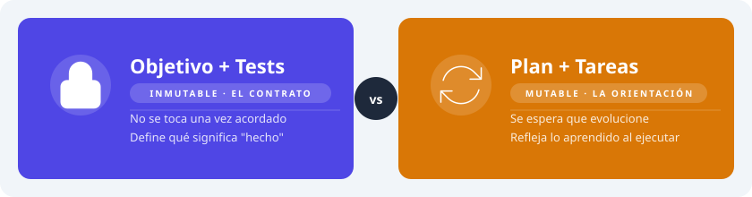
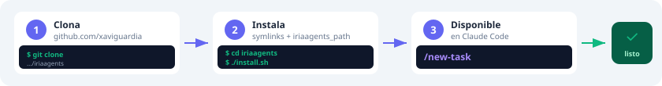
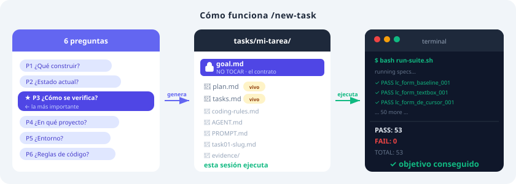
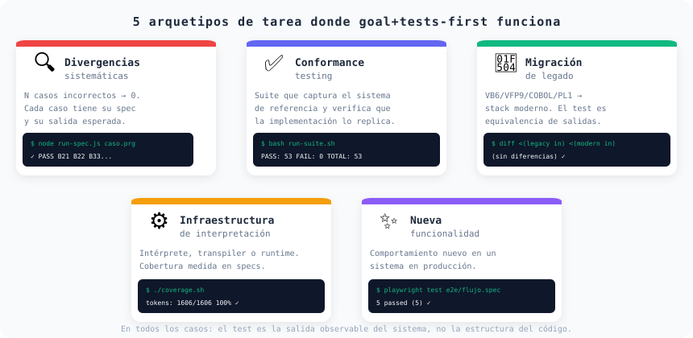

# iriaagents

> La receta es centrarse en el objetivo.

Más de 20 proyectos terminados en 2026 usando la misma técnica: definir primero qué hay que conseguir y cómo demostrar que está conseguido. El resto — el plan, los pasos, las decisiones técnicas — se adapta sobre la marcha.

---

## La idea



Antes de escribir código, responde dos preguntas:

1. **¿Qué hay que conseguir?**
2. **¿Cómo sabremos que está hecho?** — el comando exacto con la salida esperada.

Esas dos respuestas son el contrato. No cambian.

Todo lo demás — cómo llegar, qué tecnología usar, en qué orden — evoluciona con lo que aprendes al ejecutar. Si la respuesta a la segunda pregunta es vaga, no existe objetivo real todavía.

---

## Instalación



```bash
git clone https://github.com/xaviguardia/iriaagents
cd iriaagents
./install.sh
```

Crea symlinks en `~/.claude/commands/`. Desde ese momento `/new-task` está disponible en Claude Code.

```bash
./install.sh --list       # skills instalados
./install.sh --force      # actualizar tras git pull
./install.sh --uninstall  # desinstalar
```

---

## Cómo funciona `/new-task`



Una conversación de 7 preguntas. Las dos primeras son el núcleo:

- **¿Qué hay que conseguir?**
- **¿Cómo se demuestra que está conseguido?**

El skill no avanza si la segunda respuesta es vaga. Una vez acordadas, genera `tasks/<nombre>/` con todo lo necesario para arrancar. Si el proyecto usa GitFlow crea la rama `feature/<nombre>` y el worktree automáticamente.

---

## Dónde lo hemos usado

Más de 20 proyectos terminados en 2026. Cinco patrones que se repiten:



### Arreglar N casos que fallan

Tienes una lista de casos incorrectos. El objetivo es llevarlos a cero.

```bash
node run-spec.js specs/B21.prg   # → PASS
grep "FIXED" report/divergences/ # → todos cerrados
```

40 bugs VFP9→JS cerrados. Fixes en intérpretes PL/I, COBOL y CICS.

---

### Verificar que dos sistemas se comportan igual

Construyes una suite de tests contra el sistema original. La implementación nueva tiene que pasar esa misma suite.

```bash
bash run-suite.sh
# PASS: 53   FAIL: 0
```

53 escenarios de ciclo de vida VFP9. Pipeline golden master WinGest8. Equivalencia COBOL→Rust.

---

### Convertir un sistema antiguo a tecnología moderna

El código cambia completamente. El comportamiento no. El test es comparar salidas, no leer código.

```bash
diff <(run-legacy input.dat) <(run-modern input.dat)  # sin diferencias
./e2e-suite.sh                                         # todo verde
```

VFP9→Java, VB6→React, COBOL/PL1→Rust, mainframe→cloud.

---

### Construir un intérprete o runtime

Implementas soporte para un lenguaje. La cobertura se mide en programas que ejecutan correctamente.

```bash
./coverage.sh   # 1606/1606 programas  100%
```

Intérprete VFP9 JS, intérprete PL/I (ECMA-50), gateway CICS+TCP, pipeline JCL.

---

### Añadir una funcionalidad nueva

El sistema existe y funciona. Añades algo. El test prueba el comportamiento nuevo, no la estructura del código.

```bash
./health.sh --symbols STRTRAN        # nueva opción funciona
playwright test e2e/nuevo-flujo.spec # flujo completo verde
```

Flags de filtrado en conformance tooling. Dark mode. Dashboard de tokens. Editor de traducciones. Visual editor SDUI.

---

## El plan cambia. El objetivo no.

**Lifecycle VFP9 — 0 a 53/53 PASS**
El plan inicial era arreglar el orden de tres eventos. Al ejecutar aparecieron ocho problemas que nadie había visto antes. El plan se reescribió cinco veces. Los tests: ni una coma.

**40 bugs cerrados**
Las tareas estaban agrupadas por tipo. El orden de ejecución real fue completamente distinto — las dependencias solo se ven al ejecutar. El plan lo absorbió. El objetivo no se tocó.

**Flags `--symbols` y `--tokens`**
La tarea era solo `--symbols`. Al implementarlo apareció la necesidad obvia de `--tokens`. Se añadió sobre la marcha. El objetivo creció. Los tests crecieron con él.

---

## Adaptar al proyecto

| Archivo | Regla |
|---------|-------|
| `goal.md` | No tocar. Si el objetivo cambia, es una tarea nueva. |
| `plan.md` | Reescribir cuando la solución real difiere. |
| `tasks.md` | Añadir, eliminar, reordenar según avanza. |
| `evidence/` | Guardar diffs, logs y capturas que demuestran el avance. |

---

## Añadir un skill nuevo

```bash
vim commands/mi-skill.md
./install.sh --force
# disponible como /mi-skill en Claude Code
```

---

## Requisitos

- [Claude Code](https://claude.ai/code)
- Git
